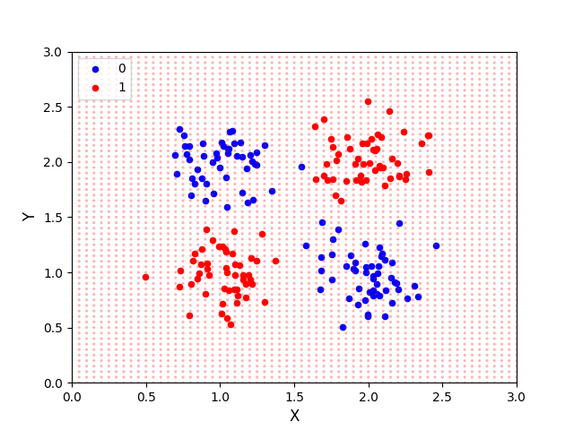
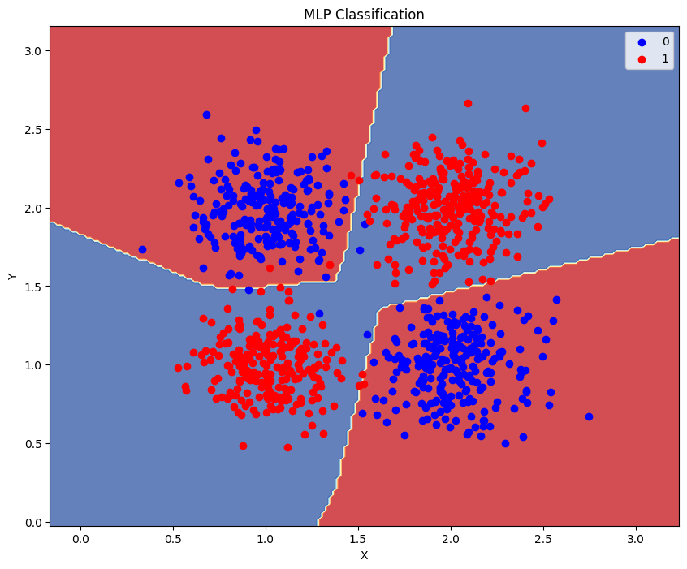

# deep-learning-perceptron-classifier
🪻Self-Study of ML : Comparison of SLP and MLP for Iris-like Dataset Classification

# MLP vs Perceptron: Iris-like Classification

This project demonstrates the difference between a Single Layer Perceptron and a Multi-Layer Perceptron (MLP) in classifying an Iris-like dataset that is not linearly separable.

## Personal Learning Journey

As a Computer Science major, I am currently studying deep learning and machine learning through my university courses. This project is part of my individual practice and study during this semester, where I'm applying the concepts I've learned in class to real-world problems.

## Overview

Used a synthetic dataset similar to the Iris dataset but with non-linearly separable classes. you can then implement and compare:
1. A Single Layer Perceptron
2. A Multi-Layer Perceptron

The results show that while the Single Layer Perceptron struggles with this dataset, the MLP can effectively classify the data points.

## Files

- `data_preparation.py`: Contains functions to generate the synthetic dataset.
- `single_layer_perceptron.py`: Implements and visualizes results for a Single Layer Perceptron.
- `multi_layer_perceptron.py`: Implements and visualizes results for a Multi-Layer Perceptron using scikit-learn.

## Requirements

To install the required packages, run:
 
`pip install -r requirements.txt`
 

## Usage

Run each Python file separately:
 
`python single_layer_perceptron.py`
 
`python multi_layer_perceptron.py`

## Problem Analysis and Solution Approach

Upon executing the Single Layer Perceptron, I observed that it failed to clearly classify the two classes. This is because the data was generated in a form that is not linearly separable. The visualization results show that the two classes are intricately intertwined, making it impossible to distinguish them with a simple straight line.

### Considered Solutions

To address this challenge, I considered several approaches:

1. **Using a Multi-Layer Perceptron (MLP)**: This can learn more complex decision boundaries.
2. **Adding Non-linear Features**: Creating new features by squaring or multiplying original features.
3. **Employing Alternative Classification Algorithms**: Such as Support Vector Machines (SVM) or Decision Trees.

### Choosing MLP

After careful consideration, I decided to implement a Multi-Layer Perceptron (MLP) for the following reasons:

1. **Non-linear Separation**: The given data is not linearly separable. MLP can learn non-linear decision boundaries.
2. **Complex Pattern Recognition**: MLP, with its multiple layers of neurons, can learn more complex features.
3. **XOR Problem Similarity**: The data distribution is similar to the XOR problem, which MLP is known to solve effectively.

### Implementation

To implement the MLP, I chose to use the scikit-learn library. This decision was based on:

- The library's robust implementation of MLP.
- Ease of use and integration with my existing code.
- Extensive documentation and community support.

By adopting this approach, I aim to demonstrate the power of MLPs in solving non-linearly separable classification problems, showcasing a significant improvement over the Single Layer Perceptron in this specific scenario.

## Results

Here are the visualizations of our Single Layer Perceptron and Multi-Layer Perceptron results:

### Single Layer Perceptron

As you can see, the Single Layer Perceptron struggles to separate the classes effectively due to the non-linear nature of the data.

### Multi-Layer Perceptron

The Multi-Layer Perceptron, on the other hand, creates a complex decision boundary that accurately classifies the data points, demonstrating its ability to handle non-linearly separable data.

## Conclusion

This project illustrates the limitations of Single Layer Perceptrons and the power of MLPs in solving non-linearly separable classification problems. 

It has been a valuable learning experience in understanding the practical differences between these two approaches.